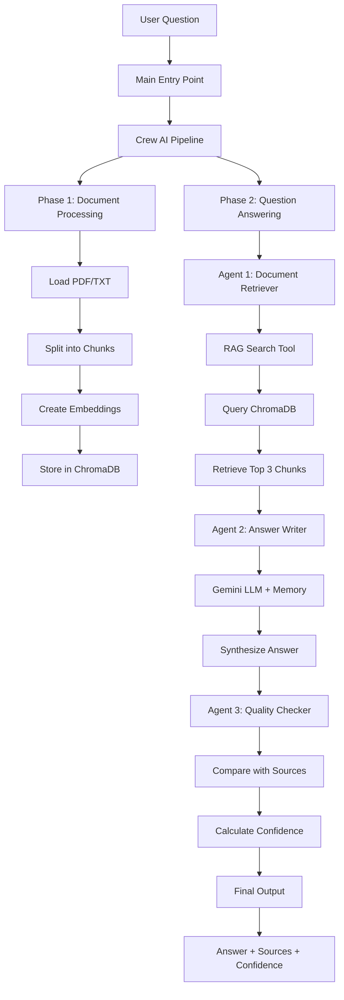
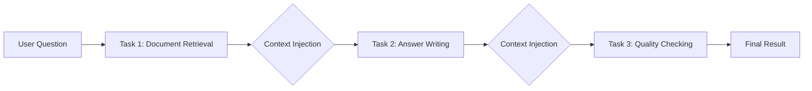
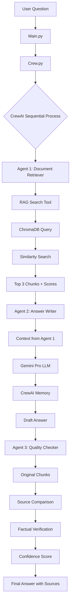
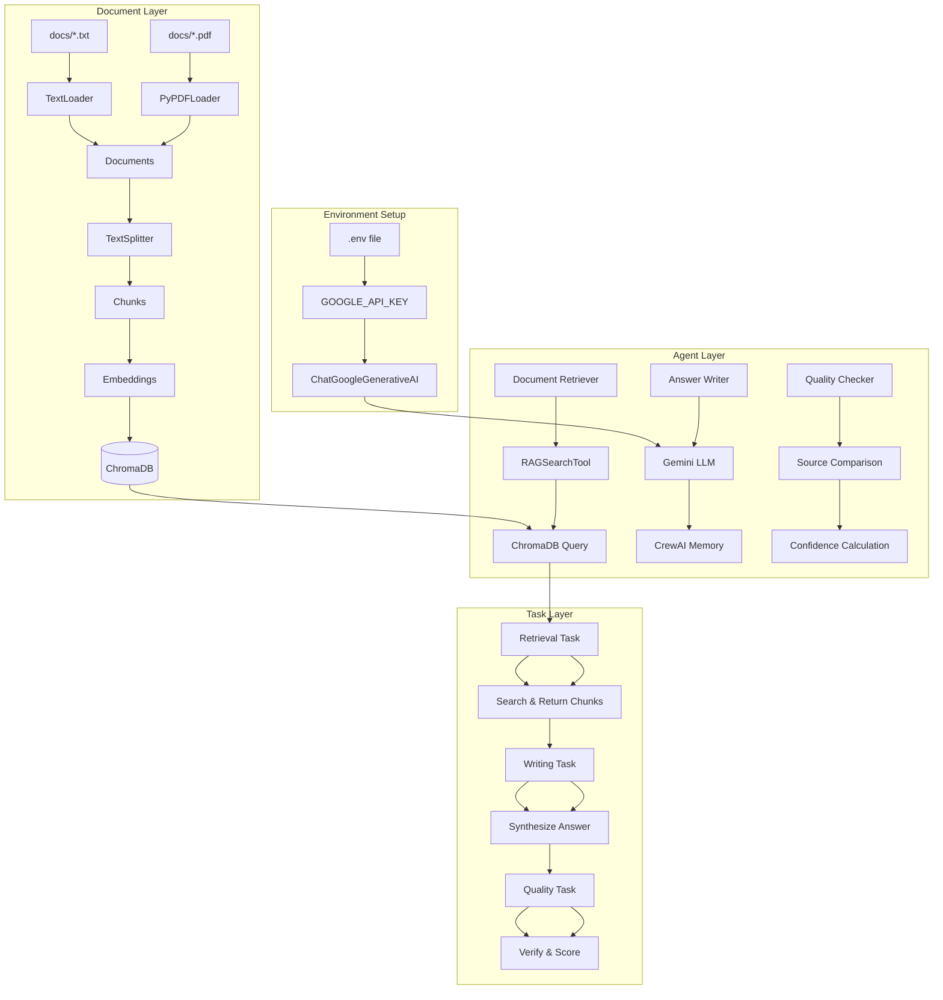
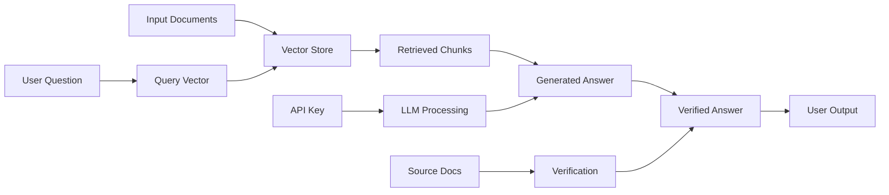
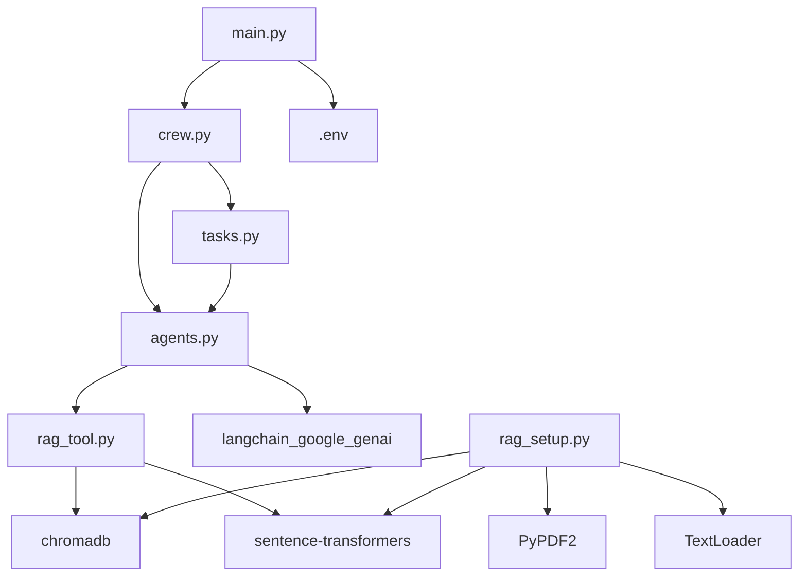
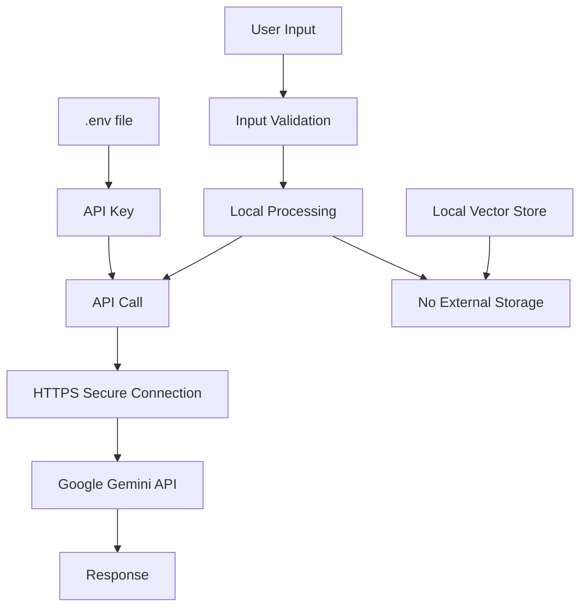

# System Architecture - Smart Q&A RAG Pipeline

## 🏗️ High-Level Architecture

## 🔄 Sequential Agent Workflow

## 📦 Component Breakdown

### Phase 1: Document Processing Pipeline

```mermaid
graph LR
    A[docs/ folder] --> B[PDF/TXT Files]
    B --> C[RAGSetup.py]
    C --> D[PyPDF2/TextLoader]
    D --> E[Raw Documents]
    E --> F[RecursiveCharacterTextSplitter]
    F --> G[Document Chunks]
    G --> H[HuggingFace Embeddings]
    H --> I[Vector Representations]
    I --> J[ChromaDB Storage]
```

### Phase 2: Query Processing Pipeline

## 🔧 Detailed Component Interactions

## 🎯 Data Flow Diagram

## 📊 File Dependencies

## 🏛️ System Layers

### Layer 1: Infrastructure
- **ChromaDB**: Vector database for semantic search
- **HuggingFace**: Embedding model (all-MiniLM-L6-v2)
- **Google Gemini**: LLM for text generation

### Layer 2: Data Processing
- **RAGSetup.py**: Document loading and preprocessing
- **TextSplitter**: Chunk creation with overlap
- **Embeddings**: Semantic vector representations

### Layer 3: Agent Framework
- **CrewAI**: Multi-agent orchestration
- **Custom Tools**: RAG search integration
- **Memory**: Context retention across tasks

### Layer 4: Application Logic
- **Sequential Process**: Ordered task execution
- **Context Injection**: Passing results between agents
- **Quality Assurance**: Verification and scoring

### Layer 5: User Interface
- **CLI Interface**: Interactive question-answer loop
- **Formatted Output**: Structured results display
- **Error Handling**: User-friendly messages

## 🔐 Security Architecture

## 📈 Performance Considerations

### Memory Usage
- Embeddings loaded once at startup
- ChromaDB persists to disk
- CrewAI memory enables context without re-computation

### Speed Optimizations
- Chunk caching avoids re-processing
- Vector store persistence
- Sequential processing prevents race conditions

### Scalability
- Add more documents → Automatic chunk indexing
- Multiple questions → CrewAI memory maintains context
- Larger documents → Configurable chunk parameters

---

This architecture ensures:
✅ **Accuracy**: Source-grounded responses  
✅ **Transparency**: Clear source attribution  
✅ **Reliability**: Quality verification at each step  
✅ **Scalability**: Easy to add more documents  
✅ **Maintainability**: Modular component design
